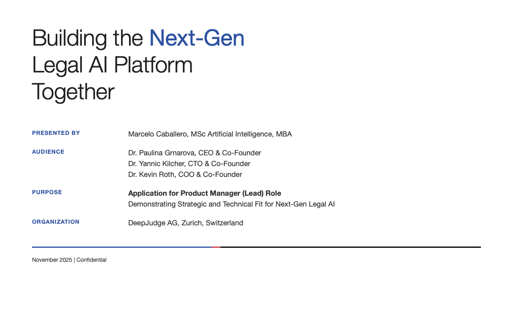

<h1 align="center">Building the Next-Gen Legal AI Platform Together</h1>

A strategic and technical vision deck for 
<strong>DeepJudge’s Platform Evolution and Product Leadership</strong> 
Work Sample for Product Manager (Lead) Role

-----

**Author:** Marcelo Caballero, MSc AI, MBA 
**Target Role:** Product Manager (Lead) 
**Length:** 43 slides 
**Sources:** Public information only, DeepJudge official communications (2023 – 2025)

-----

<table>
<thead>
<tr>
<th align="center">Deck: Product Vision & Platform Strategy</th>
</tr>
</thead>
<tbody>
<tr>
<td align="center">
 
<a href="https://github.com/MSc-AGI/DeepJudge/blob/main/Decks/Building_the_Next-Gen_Legal_AI_Platform_Together.pdf">Open on GitHub</a> •
<a href="https://gitfront.io/r/MScAI/8QM634jcfRrB/DeepJudge/raw/Decks/Building_the_Next-Gen_Legal_AI_Platform_Together.pdf">Download PDF</a>
</td>
</tr>
</tbody>
</table>

-----

## Purpose

To present a **product strategy** for DeepJudge’s next growth stage:
from a **retrieval-based knowledge system** to a **trusted, agentic workflow platform**.
This work translates DeepJudge’s technological achievements and market position into a clear operating plan that bridges product, engineering, and partnership execution with Thomson Reuters.

-----

## Why this matters

This deck shows how I think, lead, and deliver.
It reflects ten years of building platforms where **trust, compliance, and performance** define success.
It is a work sample based on public data as a proposal for DeepJudge’s evolution into the **defining infrastructure for legal AI**, a system that unites retrieval, reasoning, and workflow automation with enterprise-grade governance.

-----

## What Sets This Work Apart

  * **Layered Platform Blueprint:** Maps DeepJudge’s L1–L3 evolution (Search → Assistant → AI Workflows) into a coherent architecture and execution timeline.
  * **Strategic Symbiosis:** Frames the Thomson Reuters partnership as a growth accelerator while preserving DeepJudge’s independence and data-governance moat.
  * **Founder-Level Alignment:** Speaks the language of AI research and product delivery with equal fluency, designed for the CTO who values rigor and the CEO who values clarity.
  * **Execution Roadmap:** Defines a 90-day and 12-month plan for Layer 3 builder enablement, market feedback loops, and workflow adoption metrics.
  * **Trust as Product:** Extends the “Fort Knox” architecture into permission-aware workflow automation, anchoring DeepJudge’s long-term defensibility.

-----

## Who this is for

  * **DeepJudge Founders and Leadership** Paulina Grnarova, Yannic Kilcher, Kevin Roth.
  * **Product and Engineering Leads** defining the L3 Workflows platform.
  * **Strategic Partners** such as Thomson Reuters and early builder-law firms (Gunderson Dettmer, Homburger).
  * **Investors and Advisors** seeking a clear view of DeepJudge’s platform trajectory.

-----

## How to review

1.  **Slides 1–11: The Strategic Thesis:** Purpose, market context, the "Knowledge Layer" thesis, founder pedigree, market validation, and the Thomson Reuters catalyst.
2.  **Slides 12–21: Product & Technology Deep Dive:** The L1-L3 platform architecture, core "Hybrid Retrieval" mechanics, and "Fort Knox" security model.
3.  **Slides 22–27: The PM Role & Core Challenge:** Defines the "PaaS PM" mandate, success metrics, and the "Dual-Persona" / "Dual-Stakeholder" challenges.
4.  **Slides 28–35: Candidate Fit & Verifiable Experience:** My specific, fact-checked experience from Vorwerk and V-Zug mapped directly to the role's challenges.
5.  **Slides 36–43: Roadmap & Closing Argument:** The 90-Day Plan, 12-Month Vision, Dual-Monetization Model, and final summary.

-----

## What is inside

### Product and Strategy Chapters

  * **Knowledge Layer Thesis:** Frames DeepJudge as the missing infrastructure connecting retrieval and reasoning.
  * **Architecture Overview:** Outlines the three-tier model and permission propagation logic.
  * **User and Builder Journeys:** Depicts the dual-persona design principle central to workflow adoption.
  * **Partnership and Market Momentum:** Summarizes the Thomson Reuters alliance and top law-firm deployments.
  * **Platform Evolution Roadmap:** Defines KPIs for workflow creation, adoption, and enterprise expansion.

-----

## Repository contents

  * `Building_the_Next-Gen_Legal_AI_Platform_Together.pdf` – Full presentation (43 slides)
  * `README.md` – This guide

-----

## Contact

I welcome the opportunity to discuss this vision and how I can contribute to DeepJudge’s next chapter.

Marcelo Caballero • +41 765143830 • [msc\_ai@icloud.com](mailto:msc_ai@icloud.com)
